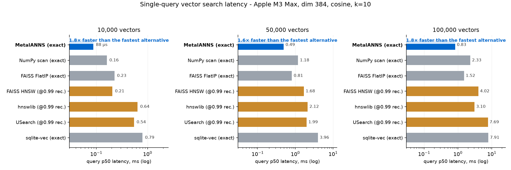

# MetalANNS 🐊

<p align="center">
  <picture>
    <source media="(prefers-color-scheme: dark)" srcset="docs/assets/banner-dark.svg">
    
  </picture>
</p>

<p align="center">
    <a href="https://swift.org"></a>
    <a href="https://developer.apple.com/metal/"></a>
    
    <a href="LICENSE"></a>
    <a href="https://github.com/christopherkarani/MetalANNS/stargazers"></a>
</p>

---

**MetalANNS** is a Swift vector search library for Apple Silicon. Search runs on-device. Default search is **exact** (recall@10 = 1.000), not a graph walk that you have to tune.

At the 10k–100k sizes typical of on-device memory, that exact path is faster on an M3 Max than FAISS, hnswlib, USearch, and sqlite-vec when those tools are held to the same recall.

*[Español](locales/README.es.md) | [日本語](locales/README.ja.md) | [Português (Brasil)](locales/README.pt-BR.md) | [中文](locales/README.zh-CN.md)*

- **Measured.** Same-machine bake-off vs FAISS / hnswlib / USearch / sqlite-vec: [BENCHMARKS.md](BENCHMARKS.md).
- **Exact by default.** Opt-in `.fast` (IVF-flat) if you want tens of microseconds and will take ~0.95–0.99 recall.
- **Swift 6.** Type-state `VectorIndex` so you cannot search an unbuilt index.
- **Filters.** Metadata DSL on top of SQLite (GRDB).
- **Persistence.** Full load, zero-copy `mmap`, or disk-backed read-only.

---

## Performance

Single-query warm p50 on Apple M3 Max, dim 384, cosine, in-process. Graph indexes (hnswlib, USearch, FAISS HNSW) were tuned until recall@10 ≥ 0.99. MetalANNS default is exact.

| Backend | 10k | 100k | Recall@10 |
|---|---:|---:|---|
| **MetalANNS exact** | **88 µs** | **831 µs** | 1.000 / 0.999 |
| FAISS IndexFlatIP | 227 µs | 1 521 µs | 1.000 |
| NumPy scan | 161 µs | 2 330 µs | 1.000 |
| sqlite-vec | 794 µs | 7 906 µs | 1.000 |
| FAISS HNSW | 207 µs | 4 024 µs | ~0.99 |
| hnswlib | 639 µs | 3 096 µs | ~0.99 |
| USearch | 545 µs | 7 693 µs | ~0.99 |

<p align="center">
  
</p>

0.999 at 100k is fp32 tie-order versus a scalar reference, not missed neighbors. Graphs only look faster here if you leave `ef` low and accept recall like 0.13. At millions of vectors they win; that is a different problem.

**Opt-in `.fast`** (IVF, nprobe chosen so recall@10 stays honest):

| n | Exact p50 | `.fast` p50 | recall@10 |
|---:|---:|---:|---:|
| 1k | 0.029 ms | 0.018 ms (nprobe 8) | 1.000 |
| 10k | 0.100 ms | 0.016 ms (nprobe 4) | 0.976 |
| 50k | 0.49 ms | 0.034 ms (nprobe 4) | 0.978 |
| 100k | 0.90 ms | 0.102 ms (nprobe 8) | 0.995 |

Do not claim 10× at 1k. Exact is already 29 µs. Reproduce commands: [BENCHMARKS.md](BENCHMARKS.md).

---

## API

Type-state index: `Unbuilt` → `Ready` → `ReadOnly`. The compiler blocks search on an unbuilt index and mutations on a read-only one.

```swift
import MetalANNS

let config = IndexConfiguration(degree: 32, metric: .cosine)
// Faster, not exact:
// IndexConfiguration(degree: 32, metric: .cosine, searchMode: .fast)
let index = VectorIndex<String, VectorIndexState.Unbuilt>(configuration: config)

let readyIndex = try await index.build(
    vectors: myEmbeddings, // [[Float]]
    ids: myDocumentIDs     // [String]
)

let results = try await readyIndex.search(query: queryVector, topK: 10) {
    QueryFilter.equals(Field<String>("category"), "research")
    QueryFilter.greaterThan(Field<Float>("relevance"), 0.85)
}

try await readyIndex.save(to: fileURL)
let loaded = try await VectorIndex<String, VectorIndexState.Ready>
    .loadReadOnly(from: fileURL, mode: .mmap)
```

---

## How search works

Default search is a fused exact scan (CPU NEON / int8 prefilter / one GPU dispatch), not a per-hop graph walk. A CAGRA-style fixed-degree graph is still built for construction, edits, and the large-n fallback. HNSW is sequential to construct; this graph is GPU-parallel. That is a construction story, not why 10k queries are 88 µs.

`.fast` probes `nprobe` inverted lists and exact-scans those rows on the CPU. No Metal round trip. Default nprobe is 4; raise it at 1k and 100k if you want recall@10 ≥ 0.99.

---

## Install

```swift
dependencies: [
    .package(url: "https://github.com/christopherkarani/MetalANNS.git", from: "0.3.0")
]
```

Platforms: macOS 14+, iOS 17+, visionOS 1+.

## License

MIT. See [LICENSE](LICENSE).
